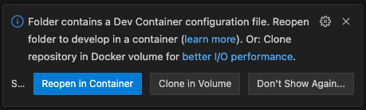

# Azure Streamlit PoC 🐳🚀☁️

## Overview

I needed to create a quick proof of concept (PoC) using Streamlit but had two constraints:

- Self-host instead of using [Streamlit community cloud](https://streamlit.io/cloud)
- Control access to the deployed website

With this in mind, containerizing and hosting on Azure was the solution. This repository provides a boilerplate to fast track this with the following implementations:

- Containerized Streamlit app with a blank `app.py` file (just add your code).
- GitHub workflow to build and publish the image to `ghcr.io`.
- Terraform code to manage infrastructure on Azure.
- GitHub workflow to execute Terraform apply & destroy infrastructure.

I hope this helps you to ship more 🚀

## What is Streamlit? 🤔

Streamlit is an open-source Python library that makes it easy to create interactive web applications for machine learning and data science projects.

[Check it out](https://streamlit.io/)

## What's the damage (WTD)? 💰

| Description | Cost (Per month) |
| ---- | ----------- |
| **B1** ($0.075/hour) tier for [Azure App Service costing](https://azure.microsoft.com/en-us/pricing/details/app-service/windows/#pricing) | $54.79 |
| Standard tier with LRS for [Azure Storage Account costing](https://azure.microsoft.com/en-us/pricing/details/storage/blobs/) (10K+ operations cost excluded as minimal usage) | $0.0184 |
| GitHub Workflows (if private repo, check [pricing](https://github.com/pricing)) | $0 |
|  **Total**   | $54.81 |

**Disclaimer**: Estimation only. Pricing might change; please refer to official documentation at the time of evaluation.

## Technologies Used 🧑‍💻

## Hosting and Deployment 🚀

- Hosting: Azure App Service.
- Deployment: GitHub Actions

## Architecture Overview 🏛️

- Interactive web-based frontend.
- Python-based backend.
- GitHub Container Registry to store the image.

## Getting Started 🧑‍💻

> This project requires an Azure subscription to run, [Get started](https://azure.microsoft.com/en-us/)

1. Create a repository from this template repo.
2. Open a shell and run `azure login`
3. Update subject field within your respository naming in infra/scripts/credential.json
4. Execute infra/scripts/initialize.sh and capture output fields
5. Setting up environments:

	- Navigate to the your repository on GitHub.
	- Go to “Settings” > “Environments”.
	- Create a new environment 'production'

6. Adding Secrets:

	- Navigate to the your repository on GitHub.
	- Go to “Settings” > “Environments” > Select “production”.
	- Go to "Environment secrets" and select "Add environment secret"
	- Add the following secrets using the output of step 4: AZURE_ENTRA_ID_CLIENT_ID, AZURE_ENTRA_ID_TENANT_ID & AZURE_SUBSCRIPTION_ID

## Development

> To begin, make sure you have the [Dev containers extension](https://marketplace.visualstudio.com/items?itemName=ms-vscode-remote.remote-containers) installed and have [Docker](https://www.docker.com/products/docker-desktop/) running. Check out [Devcontainers](https://containers.dev/) for context.

1. **Clone** this repo and open it in **Visual Studio Code**.
2. You should this this notification pop up:

    Select _Reopen in Container_ and the devcontainer will be loaded.

This will prepare your dev environment with the required tooling.

### Using a special button

This will open this repo in Visual Studio Code using a _link_. Press below:

## License 📝

This project is licensed under the MIT License - see the [LICENSE](LICENSE) file for details.
